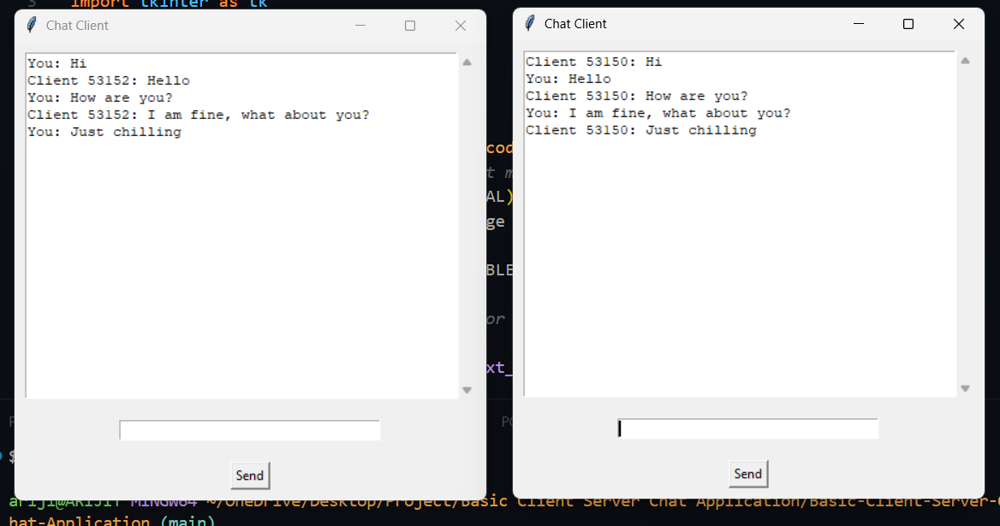

# 🗨️ Python Chat Application (Client-Server with GUI)

This is a simple multi-client chat application built with **Python**, using:
- `socket` for networking
- `threading` for handling multiple clients concurrently
- `tkinter` for building a basic chat GUI on the client side

## 📂 File Structure

main-file/
  |- server.py # Chat server that handles multiple clients
  |- client.py # GUI client that connects to the chat server


## ⚙️ Features

- Supports multiple clients connecting to a single server  
- Real-time chat messages between clients  
- Simple GUI using `Tkinter`  
- Client messages are labeled (`You:` for the sender, `Client <port>:` for others)  
- Graceful shutdown of the server with `Ctrl+C`

## 🚀 How It Works

### 🖥️ Server

- Accepts multiple client connections using threads.
- Broadcasts messages to all connected clients except the sender.
- Tags each client using their port number (`Client <port>`).

### 💬 Client

- Connects to the server and opens a chat GUI.
- Sends messages using a `Send` button or pressing `Enter`.
- Displays received messages from other clients.
- Messages sent by the user appear prefixed with `You:`.

## Requirements

- Python 3.x  
- No external libraries needed (`socket`, `threading`, and `tkinter` are built-in)

## Run the Server and Client

Here's the commands for running the server and clients:
```
python server.py
python client.py
```

# Preview

Here's a small preview of the application: 
<br>



<br>

**Developed by** - @Arijit2175